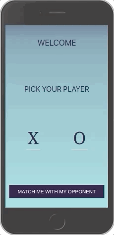

# Fairwinds Tic Tac Toe Game

[![Contributors][contributors-shield]][contributors-url]
[![Forks][forks-shield]][forks-url]

## Table of Contents

- [Brief Description](#brief-description)
- [How to use](#how-to-use)
- [Built with](#built-with)
- [Installation](#installation)
- [Functionality](#functionality)
- [Next steps](#next-steps)
- [Authors](#authors)
- [Resources](#resources)

<!-- Brief Description -->

## Brief Description
This project was a simple tic-tac-toe game that allows a user to play against the computer.

## How to use
The user can select whether they want to be X or O. Clicking the button at the bottom of the landing page takes you to the game. Currently you can play yourself and the game will declare the winner.

## Built With
- React 16
- CSS

## Installation

**Fork this repository:**

https://github.com/tarynmartin/fairwinds_project

**Clone your forked repository**

`git clone` and the copied URL

**Change into the directory and install the project dependencies**

`cd` into directory and run `npm install` for dependencies

### How to see the product

In terminal, go to the project directory and run 'yarn start' to open the project in the browser. Have fun playing!

## Functionality

### Player Selection & Game Play

## Next Steps
- Figure out computer functionality
- Using local storage to store user & computers wins vs losses
- Resetting game board
- Displaying record screen with wins and losses retrieved from local storage
- Fix styling to look the same outside of mobile view

## Authors

👤 **Taryn Martin**
- Github: [tarynmartin](https://github.com/tarynmartin)
- LinkedIn: [Taryn](https://www.linkedin.com/in/tarynmartin919/)

## Resources

[Project Wireframes](https://www.figma.com/file/xICKzY5CFZjXFubtKohgKx/tic-tac-toe-xo?node-id=1%3A2)

<!-- MARKDOWN LINKS & IMAGES -->

[contributors-shield]: https://img.shields.io/github/contributors/tarynmartin/fairwinds_project.svg?style=flat-square
[contributors-url]: https://github.com/tarynmartin/fairwinds_project/graphs/contributors
[forks-shield]: https://img.shields.io/github/forks/tarynmartin/fairwinds_project.svg?style=flat-square
[forks-url]: https://github.com/tarynmartin/fairwinds_project/network/members